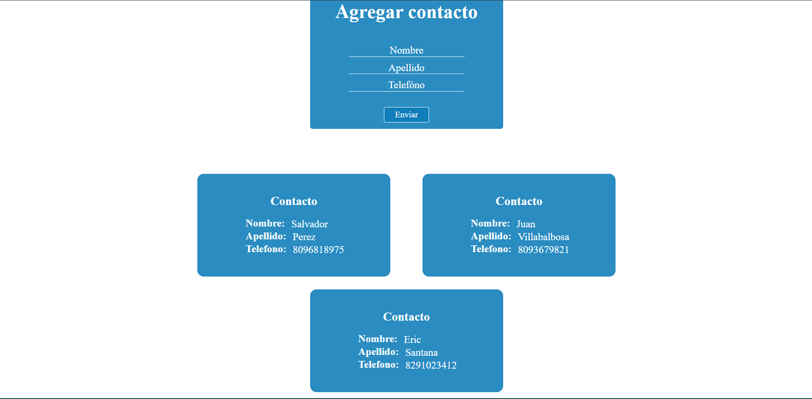

## Tarea #5 - Basilio Gianfranco De Paula Cuevas (2020-10552)

### Servicio Web

Haga un servicio Web utilizando la librería express de nodeJS que haga las dos operaciones básicas de listar y almacenar contactos realizados por el servicio http://www.raydelto.org/agenda.php el cual usted ha utilizado en las dos tarea anteriores. 

